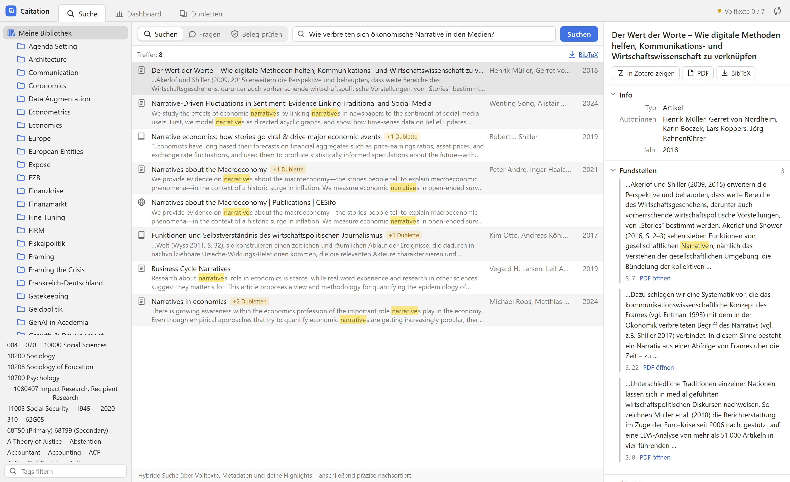
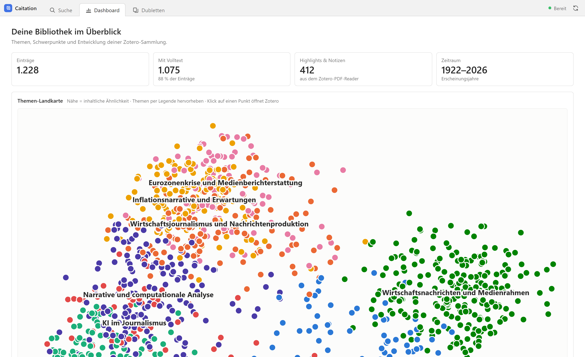
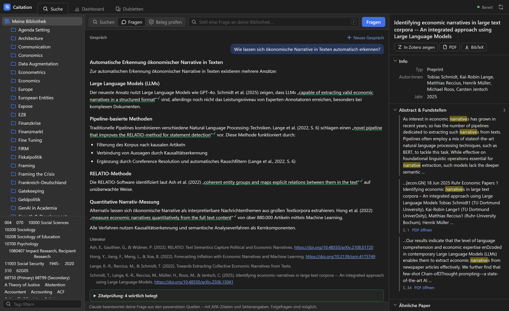
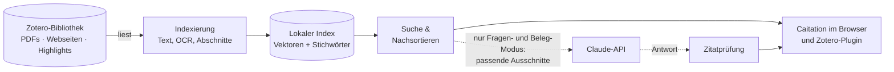

<div align="center">


# Caitation

**Durchsuchen, befragen und belegen – mit deiner eigenen Zotero-Bibliothek.**

Semantische Suche über Volltexte, Highlights und Metadaten, Antworten mit geprüften Zitaten
und ein Plugin direkt in Zotero. Läuft auf deinem Rechner, kostenlos und Open Source.

[](https://github.com/Piece-Of-Schmidt/caitation/actions/workflows/tests.yml)
[](https://github.com/Piece-Of-Schmidt/caitation/releases/latest)
[](LICENSE)


[**Download**](https://github.com/Piece-Of-Schmidt/caitation/releases/latest) ·
[Installation](#installation) ·
[Funktionen](#funktionen) ·
[Datenschutz](#datenschutz) ·
[Fragen & Probleme](#fragen--probleme) ·
[Roadmap](docs/ROADMAP.md)

<br>



</div>

<br>

> *In English:* Caitation is a local search, Q&A and citation-checking companion for Zotero.
> It indexes your PDFs, web snapshots, EPUBs and highlights on your own machine and answers
> questions with verified quotes. The interface and docs are currently in German.

## Warum Caitation?

Zotero findet Paper, wenn man weiß, wie sie heißen. Caitation findet sie, wenn man nur noch
weiß, **worum es ging**: Es versteht Fragen in natürlicher Sprache (deutsch und englisch
gemischt), durchsucht den Volltext jedes Papers und zeigt die passenden Stellen mit Seitenzahl.

- 🔎 **Suchen** über alles, was in deiner Bibliothek steckt: PDFs (auch gescannte), gespeicherte
  Webseiten, EPUBs, deine Highlights und Notizen.
- 💬 **Fragen** stellen und Antworten mit APA-Zitaten und Seitenangaben bekommen, die nur auf
  deinen eigenen Quellen beruhen.
- ✅ **Belege prüfen**: Welche Quellen stützen eine Behauptung, welche widersprechen ihr?
- 🛡️ **Jedes wörtliche Zitat wird nachgeprüft**, bevor du es übernimmst.

## Funktionen

<table>
<tr>
<td width="50%" valign="top">

### 🔎 Hybride Suche
Semantische Suche (versteht Bedeutung) und Stichwortsuche (findet exakte Begriffe wie
„FOMC“ oder Autorennamen) werden kombiniert und von einem zweiten Modell präzise
nachsortiert. Erste Treffer erscheinen sofort.

</td>
<td width="50%" valign="top">

### 🖍️ Deine Highlights zählen
Markierungen und Kommentare aus dem Zotero-PDF-Reader werden mitindexiert und bevorzugt.
Mit „Nur meine Highlights“ durchsuchst du gezielt, was du selbst für wichtig hieltest.

</td>
</tr>
<tr>
<td valign="top">

### 💬 Fragen an die Bibliothek
Claude beantwortet Fragen ausschließlich aus den passenden Stellen deiner Bibliothek, mit
APA-Zitaten, Seitenzahlen und Literaturverzeichnis. Folgefragen behalten den Kontext.

</td>
<td valign="top">

### ✅ Beleg prüfen
Füge eine Behauptung ein – Caitation zeigt pro Quelle, ob sie die Behauptung stützt oder ihr
widerspricht, jeweils mit wörtlichem Zitat.

</td>
</tr>
<tr>
<td valign="top">

### 🧩 Zotero-Plugin
Ähnliche Paper in der Seitenleiste, Text im PDF markieren → „In Caitation suchen“ oder
„Beleg prüfen“. Jeder Treffer springt zurück zum Eintrag in Zotero.

</td>
<td valign="top">

### 🗺️ Überblick über die Sammlung
Dashboard mit Themen-Landkarte der ganzen Bibliothek, Dubletten-Finder, BibTeX-Export,
Filter nach Sammlung, Tag, Typ und Jahr, Gruppenbibliotheken.



</td>
</tr>
</table>

### Zitatprüfung

Sprachmodelle zitieren manchmal ungenau. Deshalb prüft Caitation jedes wörtliche Zitat einer
Antwort automatisch gegen den Quelltext und markiert es:

| Markierung | Bedeutung |
|:-:|---|
| ✓ | **wörtlich belegt** – steht so in der Quelle, inklusive Abgleich der Seitenzahl |
| ≈ | **abweichend** – sinngemäß vorhanden, aber nicht Wort für Wort |
| ⇄ | **übersetzt** – das Original ist in einer anderen Sprache |
| ✗ | **nicht gefunden** – vor dem Übernehmen unbedingt im PDF prüfen |

<p align="center">
  
</p>

## So funktioniert's



Caitation liest deine Bibliothek über Zoteros offizielle lokale Schnittstelle, zerlegt Texte
in Abschnitte und berechnet für jeden Abschnitt lokal einen Bedeutungsvektor. Ändert sich etwas
in Zotero, merkt Caitation das innerhalb einer Minute und verarbeitet nur die geänderten
Einträge. Alles bis hierhin – und die komplette Suche – läuft
ohne Internet auf deinem Rechner. Nur wenn du eine Frage stellst oder einen Beleg prüfst,
gehen die passenden Ausschnitte an die Claude-API.

## Installation

### Windows

1. **[Caitation-Setup herunterladen](https://github.com/Piece-Of-Schmidt/caitation/releases/latest)**
   (`Caitation-Setup-<Version>.exe`) und ausführen. Adminrechte sind nicht nötig; den
   Installationsordner kannst du frei wählen (Index und Modelle brauchen einige GB).
2. Beim ersten Start richtet Caitation Python und alle Pakete selbst ein (ca. 2 Minuten),
   danach öffnet sich die Oberfläche im Browser. Das Konsolenfenster bitte offen lassen,
   solange du Caitation nutzt.
3. Für den Fragen- und Beleg-Modus: Startmenü → **Caitation-Einstellungen (API-Key)** und
   deinen [Anthropic-API-Key](https://console.anthropic.com/) eintragen. Die Suche funktioniert
   auch ohne Key.

> [!NOTE]
> Der Installer ist (noch) nicht signiert. Windows zeigt deshalb womöglich „Der Computer wurde
> durch Windows geschützt“: *Weitere Informationen → Trotzdem ausführen*.

### macOS und Linux

1. [Release-Archiv herunterladen](https://github.com/Piece-Of-Schmidt/caitation/releases/latest)
   (*Source code (zip)*) und entpacken.
2. `start.command` doppelklicken (macOS: beim ersten Mal Rechtsklick → *Öffnen*, weil die Datei
   aus dem Internet stammt). Python 3.11 und alle Pakete werden im Ordner eingerichtet, ein
   vorinstalliertes Python ist nicht nötig.
3. Den API-Key in die Datei `.env` im Caitation-Ordner eintragen (`ANTHROPIC_API_KEY=…`).

### Zotero vorbereiten: Plugin und Lesezugriff

Caitation liest deine Bibliothek über Zoteros lokale Schnittstelle (nur lesend, nur von deinem
Computer aus). Die ist in Zotero zunächst ausgeschaltet. Am einfachsten geht das Einschalten
mit dem Plugin, das Caitation außerdem direkt in Zotero bringt:

1. `caitation-zotero-<Version>.xpi` aus dem
   [neuesten Release](https://github.com/Piece-Of-Schmidt/caitation/releases/latest) herunterladen.
2. In Zotero: *Werkzeuge → Plugins → Zahnrad → Plugin aus Datei installieren…*
3. Das Plugin fragt einmal nach dem Zugriff auf deine Bibliothek: **Erlauben**.

Ohne Plugin: in Zotero unter *Einstellungen → Erweitert* die Kommunikation mit anderen
Anwendungen auf diesem Computer erlauben. Das Plugin aktualisiert sich selbst.

### Die erste Indexierung

Sobald Zotero geöffnet und der Zugriff erlaubt ist, indexiert Caitation deine Bibliothek
(auch Gruppenbibliotheken und Dateien auf anderen Laufwerken):

1. **Nach wenigen Minuten** sind Titel, Abstracts, Notizen und Highlights aller Einträge
   durchsuchbar.
2. **Danach folgen die Volltexte** im Hintergrund. Ohne Grafikkarte dauert das rund eine halbe
   Minute pro Paper; die Statusanzeige oben rechts zeigt die geschätzte Restzeit.

Du kannst Caitation währenddessen nutzen und jederzeit schließen; beim nächsten Start geht es
an derselben Stelle weiter. Danach übernimmt Caitation Änderungen in Zotero automatisch,
solange beide geöffnet sind.

## Systemanforderungen

Gemessen mit einer Bibliothek aus 1.228 Einträgen und 1.133 PDFs (3,1 GB):

| | |
|---|---|
| **Betriebssystem** | Windows 10/11, macOS mit Apple Silicon (M1 und neuer), Linux. Intel-Macs werden von aktuellem PyTorch nicht mehr unterstützt. |
| **Zotero** | 7 oder neuer, geöffnet beim Indexieren; das Plugin braucht Zotero 8 oder 9 |
| **Arbeitsspeicher** | bis zu 3 GB für Caitation, 8 GB im Rechner empfohlen |
| **Speicherplatz** | ca. 1,3 GB Python und Pakete, 1,5–2,1 GB Modelle, ca. 2 GB Index pro 1.000 Paper |
| **Download** | ca. 400 MB bei der Einrichtung, 1,5–2,1 GB Modelle beim ersten Indexieren |
| **Grafikkarte** | optional. NVIDIA-Karten (Windows, Linux) und Apple Silicon werden automatisch genutzt und beschleunigen das Indexieren deutlich. |

## Datenschutz

| Bleibt auf deinem Rechner | Geht an die Claude-API (Anthropic) |
|---|---|
| deine Bibliothek, alle PDFs und der Index | im **Fragen- und Beleg-Modus**: deine Frage und die passenden Textausschnitte aus den 6 relevantesten Papern |
| die komplette Suche, ähnliche Paper, Dubletten | im **Dashboard**: Titel einiger Paper je Themencluster, um die Themen zu benennen |
| Protokolldatei `data/caitation.log` | |

Den Lesezugriff auf Zotero gibst du über Zoteros eigene Einstellung frei. Sie gilt für alle
Programme auf deinem Computer (nur lesend, nicht übers Netzwerk) und lässt sich in den
Zotero-Einstellungen jederzeit wieder abschalten; Caitation braucht sie dann erst beim nächsten
Aktualisieren wieder.

Jede Person nutzt ihren eigenen API-Key. Ohne Key funktioniert alles außer Fragen,
Belegprüfung und Themennamen. Der Server ist nur vom eigenen Rechner aus erreichbar und weist
Anfragen fremder Websites ab.

## Konfiguration

Einstellungen stehen in der Datei `.env` im Caitation-Ordner (Windows: Startmenü →
*Caitation-Einstellungen*). Alle außer dem API-Key sind optional:

| Einstellung | Bedeutung |
|---|---|
| `ANTHROPIC_API_KEY` | Key für Fragen, Belegprüfung und Themennamen |
| `EMBEDDING_MODEL` | `intfloat/multilingual-e5-small` (Standard, schneller) oder `intfloat/multilingual-e5-base` (findet mehr) |
| `RERANKER_MODEL` | Modell fürs Nachsortieren; leer lassen schaltet es ab (schneller, ungenauer) |
| `ZOTERO_API_URL` | Adresse von Zoteros lokaler Schnittstelle, falls nicht `http://127.0.0.1:23119/api` |

Nach einem Wechsel des Embedding-Modells wird neu indexiert; jedes Modell hat einen eigenen
Index unter `data/`.

## Fragen & Probleme

<details>
<summary><b>Die Statusanzeige meldet einen Fehler oder etwas fehlt in den Ergebnissen.</b></summary>

Fehler und Laufzeiten stehen in `data/caitation.log`. Bitte diese Datei an ein
[Issue](https://github.com/Piece-Of-Schmidt/caitation/issues) hängen. Sie enthält keine
PDF-Inhalte, aber den Anfang deiner Suchanfragen – kurz durchsehen vor dem Verschicken.
</details>

<details>
<summary><b>Die Statusanzeige ist gelb: „Caitation hat noch keinen Lesezugriff auf Zotero“.</b></summary>

Der Zugriff über Zoteros lokale Schnittstelle ist ausgeschaltet. In Zotero *Werkzeuge →
Caitation: Zugriff auf die Bibliothek erlauben* wählen (mit Plugin) oder unter *Einstellungen →
Erweitert* die Kommunikation mit anderen Anwendungen erlauben. Caitation merkt das innerhalb
einer Minute.
</details>

<details>
<summary><b>Ein Paper wird nicht gefunden.</b></summary>

Prüfe, ob die Indexierung abgeschlossen ist (Statusanzeige „Bereit“). Gescannte PDFs werden per
OCR gelesen, das klappt bei schlechten Scans nicht immer. Über ↻ oben rechts lässt sich die
Indexierung jederzeit neu anstoßen; unveränderte Einträge werden dabei übersprungen.
</details>

<details>
<summary><b>Läuft Caitation auch, wenn Zotero geschlossen ist?</b></summary>

Ja, mit dem Stand, den Caitation zuletzt aus Zotero gelesen hat: Suche, Fragen, Dashboard und
PDF-Links funktionieren weiter. Neue oder geänderte Einträge übernimmt Caitation, sobald Zotero
wieder läuft. Das Plugin und die Links „In Zotero zeigen“ brauchen Zotero ohnehin.
</details>

<details>
<summary><b>Wie deinstalliere ich Caitation?</b></summary>

Windows: über *Einstellungen → Apps* oder Startmenü → *Caitation entfernen* (entfernt auch
Python, Modelle und Index). macOS/Linux: den Caitation-Ordner löschen. Deine Zotero-Bibliothek
wird nie verändert.
</details>

<details>
<summary><b>Läuft Caitation auf einer anderen Adresse als 127.0.0.1:8000?</b></summary>

Dann im Zotero-Konfigurationseditor (*Einstellungen → Erweitert → Konfigurationseditor*)
`extensions.caitation.serverURL` anpassen.
</details>

## Für Entwickler:innen

<details>
<summary><b>Manuelle Einrichtung, Tests, Projektstruktur</b></summary>

```bash
python -m venv .venv          # Python 3.11; macOS/Linux: .venv/bin/python statt .venv/Scripts/python
.venv/Scripts/python -m pip install -r requirements-dev.txt
.venv/Scripts/python -m backend --reload                  # http://127.0.0.1:8000
.venv/Scripts/python -m pytest                          # Tests
.venv/Scripts/python -m backend.indexer                 # Indexierung ohne Server
.venv/Scripts/python eval/evaluate.py                   # Suchqualität messen (Server läuft)
```

| Ordner | Inhalt |
|---|---|
| `backend/` | FastAPI-Server, Indexierung (pypdfium2, OCR, ChromaDB, SQLite FTS5), Suche, Zitatprüfung |
| `frontend/` | Oberfläche (reines HTML/CSS/JS, kein Build-Schritt) |
| `plugin/` | Zotero-Plugin; `python plugin/build.py` baut die `.xpi` |
| `installer/` | Windows-Installer (Inno Setup), gebaut von der CI |
| `eval/` | Testfragen und Messskript für die Suchqualität |
| `tests/` | pytest, läuft in der CI auf Windows, macOS und Linux |

**Release:** Version in `plugin/src/manifest.json` erhöhen, Eintrag in `plugin/updates.json`
ergänzen, Notizen unter `docs/releases/v<Version>.md` anlegen und den Tag `v<Version>` pushen.
Die CI baut Plugin und Installer und legt einen Release-Entwurf an.

Offene Punkte stehen in der [Roadmap](docs/ROADMAP.md). Beiträge und Rückmeldungen sind
willkommen.
</details>

## Lizenz und Modelle

Caitation steht unter der [MIT-Lizenz](LICENSE); alle Python-Abhängigkeiten sind frei
lizenziert (MIT, BSD, Apache-2.0). Beim ersten Start werden zwei Modelle von Hugging Face geladen:

- `intfloat/multilingual-e5-small` bzw. `-base` für die Suche (MIT-Lizenz)
- `cross-encoder/mmarco-mMiniLMv2-L12-H384-v1` fürs Nachsortieren. Das Modell steht unter
  Apache-2.0, wurde aber mit dem MS-MARCO-Datensatz trainiert, dessen Bedingungen nur
  nicht-kommerzielle Nutzung erlauben. Für Forschung und Lehre passt das; für kommerziellen
  Einsatz `RERANKER_MODEL=` leer setzen oder ein anderes Modell wählen.

Antworten im Fragen- und Beleg-Modus erzeugt Claude Haiku 4.5 über die Anthropic-API.

„Zotero“ ist eine Marke der Corporation for Digital Scholarship. Caitation ist ein
unabhängiges Projekt und nicht mit Zotero verbunden.
